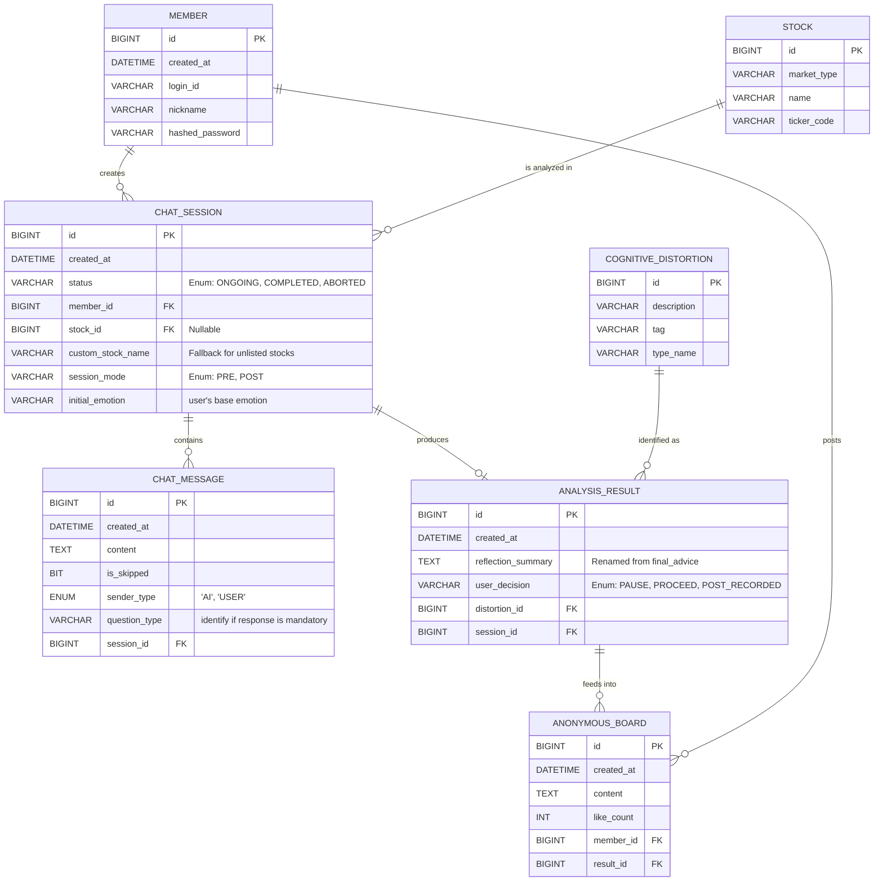

# TRADEMIND 데이터베이스 스키마 설계 (ERD)

이 문서는 TRADEMIND 프로젝트의 초기 데이터베이스 구조(ERD)와, 해커톤 기간 내 빠른 개발 및 기획 스펙 반영을 위해 합의된 설계 보완점을 기록합니다.

## 1. 개요

TRADEMIND의 핵심 비즈니스 로직(사전/사후 흐름, CBT 인지 왜곡 진단, 커뮤니티 데이터 집계)을 담고 있으며, "투자자의 멘탈을 진단하고, 결과를 다른 사람들과 공유한다"는 컨셉을 효과적으로 구현하기 위한 구조입니다.

## 2. 기존 ERD 명세 (초안 구조)

초기 논의된 관계형 데이터베이스 테이블들은 다음과 같습니다.

*   `member`: 사용자 회원 정보 
*   `stock`: 종목 메타 데이터 (해커톤 MVP 구현 시 후순위/선택사항)
*   `chat_session`: 사용자-AI 간 하나의 상담 세션 
*   `chat_message`: 세션 내 주고받은 대화
*   `cognitive_distortion`: CBT 관점의 인지 왜곡 유형 (마스터 데이터)
*   `analysis_result`: 상담이 끝난 후 도출된 결과 및 사용자의 최종 선택
*   `anonymous_board`: 비슷한 상황의 다른 사용자에게 노출될 익명 커뮤니티 데이터

## 3. 해커톤 맞춤형 설계 보완 및 합의 사항

해커톤의 "빠른 동작 구현 우선" 원칙과 세부 기획 사항, 그리고 법률적 리스크(Product Truth)를 적극 반영하여 아래와 같이 개선 방향을 확정했습니다.

### 3.1. `member` (회원 관리)
*   **합의 사항:** 해커톤 데스크 체크(시연) 진행을 위해 전통적인 로그인 절차가 기능하기만 한다면 무방함.
*   **반영:** `login_id`, `hashed_password`, `nickname` 컬럼 형태를 그대로 유지하여 자체/로컬 로그인을 구현. (문서 오해를 막기 위해 password -> hashed_password 로 명시 변경)

### 3.2. `chat_session` (대화 세션)
*   **합의 사항:** 사전(살까/팔까) 및 사후(이미 매매함) 모드 구분이 필수적이며, 검색 없이 사용자가 직접 입력한 종목명을 유연하게 처리해야 함. 또한, 첫 입력으로 받아온 감정 값 관리가 필요함.
*   **반영:**
    *   `session_mode`: 세션의 모드를 판단할 플래그 추가.
    *   `initial_emotion` (VARCHAR): 유저가 진입할 때 고른 "초기 감정" 단일 값 (예: 조급해요) 기록. (추후 복수 선택 배열로 확장 가능)
    *   `custom_stock_name` (VARCHAR): `stock_id`가 지정되지 않은 자유 텍스트 종목 입력을 대비한 Fallback 속성 추가. `stock_id`는 Nullable로 변경.

### 3.3. `chat_message` (채팅 메시지)
*   **합의 사항:** AI가 던지는 질문의 성격(예: 답변 필수인 메타인지 질문 vs 건너뛸 수 있는 탐색형 질문)인지 프론트엔드가 알고 처리할 수 있어야 함.
*   **반영:** AI 메시지 저장 시 `question_type` 속성을 추가로 저장하여 MVP 수준에서의 상대 복원을 지원함. (JSON 페이로드 등은 해커톤 이후 고려)

### 3.4. `analysis_result` (진단 결과)
*   **합의 사항:** 투자 조언(advice)을 저장하는 듯한 톤은 서비스 성격과 법률 리스크 면에서 극도로 위험함.
*   **반영:** `final_advice`를 `reflection_summary` (또는 `result_summary`)로 변경하여 AI가 아닌 유저 스스로의 메타인지 요약임을 명확히 명시.

### 3.5. `anonymous_board` (공유 피드)
*   **합의 사항:** 기획상 익명 "한 줄 이유"만 노출하는 형태이므로, 굳이 제목(Title)을 받을 필요 없이 구조를 단순화.
*   **반영:** 별도 스냅샷 처리 등은 배제하고, `title` 식별자 없이 `content` 기반의 단일 컬럼으로 축소 최적화.

### 3.6. 중요: 주요 컬럼의 상태/허용 값 (Enum) 명세
팀 내 혼선을 방지하기 위해 각 흐름을 분기하는 중요 컬럼의 허용 값을 아래와 같이 고정합니다.
*   `chat_session.session_mode`: `['PRE', 'POST']` 
*   `chat_session.status`: `['ONGOING', 'COMPLETED', 'ABORTED']`
*   `analysis_result.user_decision`: `['PAUSE', 'PROCEED', 'POST_RECORDED']`
    *   `PAUSE` → UI 문구: `잠시 관망하겠습니다`
    *   `PROCEED` → UI 문구: `그래도 진행하겠습니다`
    *   `POST_RECORDED` → UI 문구: `기록이 저장됐어요`
*   **합의 사항:** 버튼 문구는 UX 라이팅에 맞춰 자유롭게 다듬되, 저장값은 내부 enum으로 고정한다. 그래야 대시보드 집계, 퍼널 분석, 문구 변경 대응이 쉬워진다.

### 3.7. 결과 저장 시점 관련 운영 메모

현재 프로토타입 기준의 제품 의미는 아래와 같습니다.

*   `post` 모드: 결과 화면이 보일 때는 이미 복기 기록이 남아 있는 상태로 읽힌다. 결과 CTA는 저장 버튼이 아니라 `멘탈 캘린더 보기` 같은 이동 CTA에 가깝다.
*   `pre` 모드: 결과 화면이 보일 때는 분석 요약이 준비된 상태이고, 사용자가 `PAUSE / PROCEED` 중 하나를 누를 때 최종 선택이 확정된다.

중요:

*   이 문서는 **ERD 변경을 지금 당장 전제하지 않는다.**
*   즉, 위 제품 의미를 구현하기 위해 스키마를 먼저 바꾸기보다, 백엔드에서 현재 스키마 기준으로 저장 시점과 create/update 순서를 판단할 수 있다.
*   해커톤 단계에서는 아래 두 구현 방식 중 하나를 선택해도 제품 의미는 유지된다.
    *   `post`: 결과 진입 시 `analysis_result` 생성 및 `POST_RECORDED` 저장
    *   `pre`: 결과 진입 시 분석 결과를 먼저 저장하고, 최종 버튼에서 `PAUSE / PROCEED` 업데이트
    *   또는 현재 스키마 제약상 `user_decision` null 처리가 불편하면, `pre`는 최종 선택 시점에만 `analysis_result`를 생성하는 방식으로 구현해도 무방
*   따라서 현재 단계에서 우선 필요한 것은 **스키마 변경 여부 확정**이 아니라, 백엔드가 어떤 저장 시점을 선택할지 합의하는 것이다.

---

## 4. 최종 ERD 스키마도 (개선사항 반영 버전)

아래는 보완 및 합의된 내역을 컬럼으로 반영시킨 최종 ERD 다이어그램(Mermaid)입니다.

